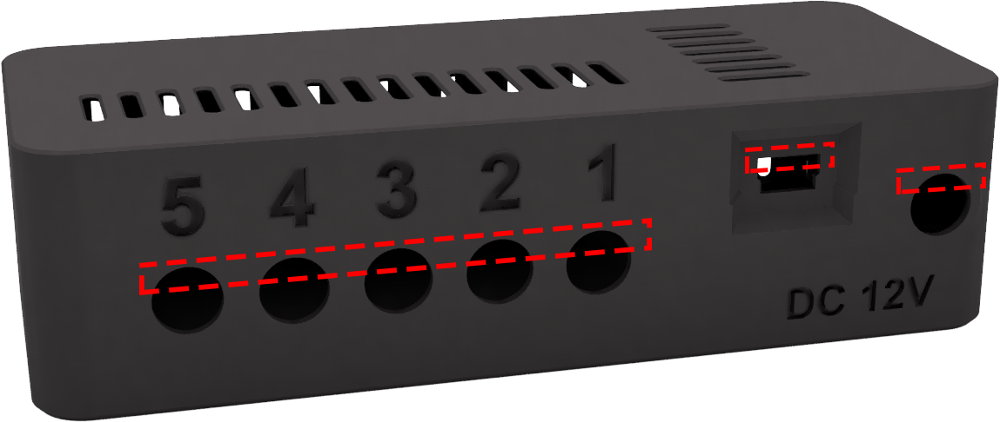
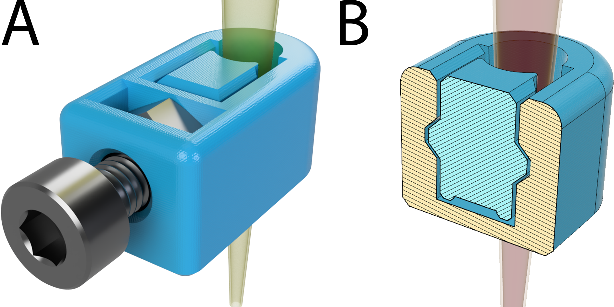
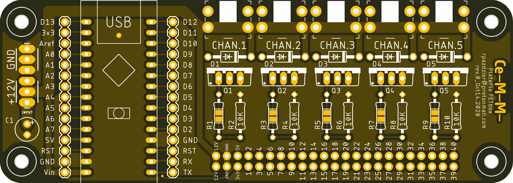
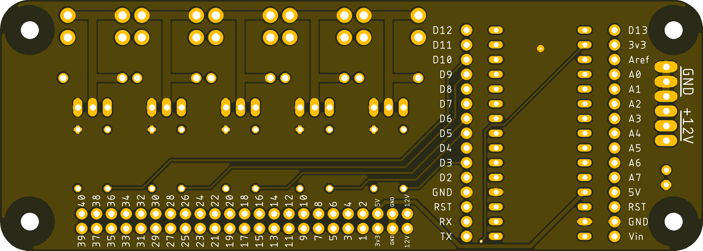
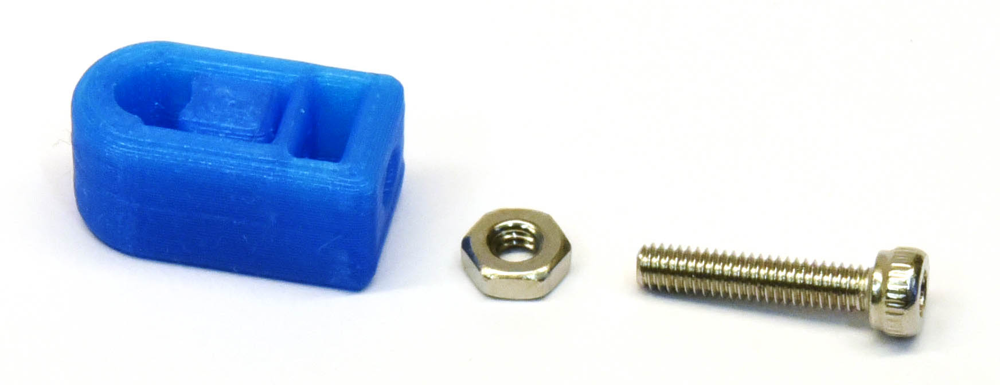

Build Guide
###########

3D Printing Guidelines
^^^^^^^^^^^^^^^^^^^^^^

Parts are designed and oriented optimally for fused deposition modeling (FDM) 3D
printing. Parts pictured in proceeding sections were printed on a Prusa i3 MK3S
3D printer in “Galaxy Black” Prusament PLA. 

.. sidebar:: Print Settings

    Unless otherwise noted, the following print settings can be used as a
    general guideline when slicing the included design files for printing:

    * 0.4 mm extrusion width
    * 0.2 mm layer height
    * 3 perimeters; 5 top/bottom layers
    * 20% infill
    * No supports required

    Parts that warrant special print considerations are discussed in the
    following sections.

FETbox Enclosure
================

Depending on several printer-specific conditions including parting cooling,
print speed, and material properties, it may be necessary to clean up the
overhangs and bridge areas:

        Areas that may require post-print clean-up to remove hanging material.
        
Skimmer Nozzle Clamp
====================

        
This part was modelled with a print-in-place sliding mechanism for securly 
clamping the P200 tip in place without damaging it with bolt. 

        A) Skimmer clamp, assembled. B) Print-in-place clamping mechanism. Note
        how the slide does not contact the surrounding clamp body at any point
        but is fully contained.

The clamp slide should break free with minimal effort and then slide freely
after using the method described in `Skimmer Nozzle Clamp`_. Because of the
small size of this part, printing just one at a time can lead to overheating
artifacts. Print at least two or three at once while optimizing print settings. 

.. Tip::

        Most popular slicing software have the option to reduce the
        material flowrate on un-supported extrusions. The first layers of the underside
        of the clamp benefit from this feature. 
        
        Using PrusaSlicer 2.2.0 [1]_ we had success with a bridge flow ratio of
        0.7, for example. 

.. Tip::
        It may also be advantageous to use a 0.1 mm layer
        height for this part as less material is deposited at once and is less
        likely to adhere irreversibly unintended layers below.

Skimmer Nozzle Height Blocks
============================

The thickness of the nozzle height setting blocks (and consequently the skimmer
nozzle height) is particularly sensitive to first layer height calibration and
it is recommended that the printed height be validated with a micrometer, high
quality calipers, or more empirically by measuring the residual plate volume.

FETbox Hardware Controller
^^^^^^^^^^^^^^^^^^^^^^^^^^

PCB Ordering
============

        FETbox PCB render (top).

        FETbox PCB render (bottom).

The FETbox printed circuit board (PCB) was designed with professional
manufacture in mind and is not necessarily optimized for e.g. DIY
milling/etching. There are many services available for small-run prototype PCB
production, making it feasible to order several bare PCBs at an affordable rate.

At the time of writing, JLCPCB (China) [2]_ offers such a service and provided
the boards pictured herein. We opted for a black PCB and ENIG-RoHS surface
finish; however, these are optional and primarily cosmetic features in this
case. The included Gerber computer aided manufacturing (CAM) files were
generated according to JLCPCB’s capabilities [3]_ via Autodesk EAGLE [4]_ using
oxullo’s helper files [5]_, [6]_. Similarly, ``FETbox_rev0_PCB.brd`` can be used
to generate CAM files for other PCB manufacturers using appropriate
specifications and EAGLE design software.

To place an order with JLCPCB, upload ``FETbox_rev0_Gerber_JLCPCB.zip`` and
select the PCB colour and surface finish as desired. The board dimensions will
be derived automatically from the Gerber files. 

Other options can be left in their default state:

* 2 layers
* 1 design
* single PCB delivery format
* 1.6mm thickness 
* 1 oz copper weight
* no gold fingers, no production file confirmation
* fully tested flying probe
* no castellated holes
* no order number removal.

PCB Assembly
============

.. tip::

        For ease of assembly, it is recommended to solder diodes and resistors to the
        PCB prior to the output jacks and MOSFETS as the shorter components are more
        difficult to access once the taller MOSFETs and output jacks are mounted. 

.. tip::

        Axial component leads need to be bent 90° prior to soldering, this can
        be done with any pair of plyers, however a 3D-printed jig such as
        https://www.thingiverse.com/thing:26025 can make the task less finicky.
        Hole spacing on all diodes and resistors on the PCB are 0.4”/10.16 mm.

Instructions
------------

1.	Solder the fly-back diodes (D1-D5) to the board.

        .. figure:: img/soldering_1.jpg
                :scale: 25%

2.	Solder the 10kΩ pull-down resistors (R2, R4, R6, R8, R10) to the board.

        .. figure:: img/soldering_2.jpg
                :scale: 25%

3.	`Optional`: Current-limiting gate resistors can be added in the 
        odd-numbered resistor positions (R1, R3, R5, etc.). Though they are not
        absolutely necessary in the author's opinion.

        .. important::

                If a gate resistor is not used, the central pads at these 
                positions must be bridged with solder as below.

                .. figure:: img/board_solder_bridge.png
                        :scale: 50%

4.	Solder the 3.5mm output jacks to the PCB. Note that due to the mass of
        copper around these solder pads conducting heat away, it may be
        necessary to
        increase the soldering iron temperature to make a proper joint here.

        .. figure:: img/soldering_3.jpg
                :scale: 25%

5.	Solder the MOSFETs (Q1-Q5) to the PCB. As in the previous step, some of
        the MOSFETs pads will require more heat to make a proper joint here.

        .. figure:: img/soldering_4.jpg
                :scale: 25%

6.	Trim two 30-pin strips from the female headers using side cutters.

7.	Socket the Arduino Nano pins into the trimmed header strips before 
        soldering the female headers to the board. This will ensure proper 
        alignment and is easier to solder.

        .. figure:: img/soldering_5.jpg
                :scale: 25%

8.	Solder the decoupling capacitor (C1) to the power input of board. 
        

        .. figure:: img/soldering_6.jpg
                :scale: 25%

        .. warning::

               **Take care with the polarity of the capacitor!** The negative
               terminal will usually have a white stripe and/or shorter
               lead.

               Reversing the polarity may cause the capacitor to explode.

9.	Cut 2× 2-3 cm of 0.5mm\ :superscript:`2` (20 AWG) wire for the 12V DC
        input jack and strip a few millimeters from each end.

10.	Solder one end of each wire to the barrel and center pin tabs of the DC
        jack, apply heat shrink tubing to the tabs if available.

11.	Solder the DC jack center pin wire to one of the +12V solder pads at the
        power input. Likewise, for the barrel wire to one of the GND pads.
        
        .. tip::
                Additional pads, connected in parallel, are provided in case one
                wishes to power additional devices from the board input.

12.	Bend the wires into a gentle loop away from the top edge of the board.

        .. figure:: img/pcb_dc_jack_wiring.jpg
                :scale: 15%

                DC jack wired and soldered.

13.	Trim excess leads from the bottom of the board using the side cutters
        if you have not done so already.

        .. figure:: img/pcb_trimmed_underside.jpg
                :scale: 10%

                Soldered and trimmed leads.

Final Assembly
==============

1.	Using an M3×8 bolt, thread all four standoffs on the inside of the 
        bottom half of the enclosure by driving the bolt in then out, one at a
        time. There will be significant resistance as the bolt cuts a thread 
        into the printed plastic. 
        
        .. warning::

                Do not overtighten! Plastic threads can be easily stripped.

2.	Ensure there is adequate clearance for the M3 bolt to pass through the
        PCB mounting holes of the PCB. 
        
        PCB machining tolerance varies with manufacturer and a quick pass with
        a 3 mm drill bit or with the M3 bolt itself might be necessary.

3.	Remove all nuts and washers from the DC jack and controller
        output jacks.

4.	Socket the Arduino Nano into the controller board with its USB port
        oriented as printed on the PCB silkscreen.

        .. figure:: img/pcb_assembled.jpg
                :scale: 15%

5.	Insert the board at an angle into the mounting holes of the enclosure.
        The board will sit flat with the base of the enclosure once these are
        through.

        .. figure:: img/assembly_board_in.jpg
                :scale: 15%

6.	Secure the PCB to the enclosure bottom using four M3×8 bolts.

7.	Re-install the washers and nuts for the DC input jack and controller
        output jacks. Do not overtighten the nuts on the output jacks.

        .. figure:: img/fetbox_assembled.jpg
                :scale: 15%

8.	Snap the enclosure lid in place with the convective cooling slots over
        the MOSFET array and Arduino.

Firmware Upload
===============

The FETbox controller firmware is supplied as an Arduino ‘sketch’ for upload
via the :program:`Arduino IDE` software. 

1.	Install the :program:`Arduino IDE` software and USB drivers per the
        instructions for your system [7]. 

2.	Connect the hardware controller using a USB mini-B cable. 

3.	Open the hardware controller sketch, ``Firmware_FETbox.ino`` with
        :program:`Arduino IDE`. 

4.	Set the target board, processor and serial port:
        
        :guilabel:`Tools` -> :guilabel:`Board` -> :guilabel:`Arduino Nano`,
        
        :guilabel:`Tools` -> :guilabel:`Processor` -> :guilabel:`ATmega328P`,
        
        :guilabel:`Tools` -> :guilabel:`Port` -> :guilabel:`<Port>`
        
        Note: :guilabel:`Tools` -> :guilabel:`Get Board Info` can sometimes set
        these automatically.

5.	Upload the sketch to the hardware controller Arduino:
        
        :guilabel:`Sketch` -> :guilabel:`&Upload`

6.	Once uploaded, verify that the upload was successful:

        a.	Open the serial monitor: 
                :guilabel:`Tools` -> :guilabel:`Serial Monitor`
        
        b.	Set the line ending to ``Newline`` and the baud rate to 
                ``115200``.

        c.	Type ``@#`` into the serial monitor and press Send or
                :kbd:`Return`. 

If the sketch was successfully uploaded, the board will respond with ``fetbox0``
in the serial monitor.

Nunc OmniTray Perfusion Plate
^^^^^^^^^^^^^^^^^^^^^^^^^^^^^^^^

_`Skimmer Nozzle Clamp`
========================

        Parts, from left to right: printed ``skimmer_clamp_M2.5.stl``, 
        M2.5 hex nut, M2.5×8mm bolt.

1.	Insert the M2.5 hex nut and thread in the M2.5 bolt until finger tight.

        .. figure:: img/skimmer_clamp_fingertight.jpg
                :scale: 25%

2.	Using a 2 mm hex driver, tighten sharply until the slide breaks free,
        then continue until the clamp slide has moved through its entire range
        of motion (below, right).

        .. figure:: img/skimmer_clamp_slide.jpg
                :scale: 25%

                **Left:** Twist sharply to break the weak connection on the
                slide underside. 
                **Right** Continue until the end of the slide
                travel range.

3.	Back off the bolt until it is clear of the slide travel.

4.	Using a small flat screwdriver or a P200 tip, push the slide back to its
        starting position.

        .. figure:: img/skimmer_clamp_slidereturn.jpg
                :scale: 15%

                **Left**: use the screwdriver as a lever to push the slide back,
                there may be resistance the first time the slide moves.
                **Right**: The slide back in its starting position, ready for use.

Perfusion Plate Lid
===================

1.	Using the perfusion_plate_jig and a fine-tipped marker, transfer the
        four nozzle hole locations to the Nunc OmniTray lid.

        .. figure:: img/lid_tools.jpg
                :scale: 15%

        .. figure:: img/lid_marking_jig.jpg
                :scale: 15%

        .. figure:: img/lid_marking_marked.jpg
                :scale: 15%

2.	Using a 2.2mm\ [*]_ PCB milling bit/tool, drill all four marked holes.

        .. tip::

                Use a peck drilling technique to limit plastic melt and improve
                hole dimensional accuracy and consistency.

        .. figure:: img/lid_drilling.jpg
                :scale: 15%

3.	Clean all plastic debris from the lid and wipe with 70% EtOH.

        .. figure:: img/lid_drilled.jpg
                :scale: 15%

4.	Apply a small amount of cyanoacrylate glue to the bottom of a skimmer
        nozzle clamp.

5.	Align the clamp with the drilled skimmer hole as below, 
        press firmly, then allow to cure.

        .. figure:: img/skimmer_clamp_hole_alignment.jpg
                :scale: 25%

                Align the drilled hole with the edge of the clamp hole farthest
                from the slide and bolt. This will prevent pinching if the hole
                sizes differ significantly.

#.	Place the lid on an OmniTray base.

#.      If necessary, trim P200 to length\ [*]_.

.. _tip-fit:

#.	Insert the inlet and outlet P200 tips firmly into place. 

        It may be necessary to twist the P200s into final position. With a
        proper fit, a P200 will sit securely in the drilled hole, with the
        tip just above the culture surface, but below the expected fluid height
        (<1 mm, typically).
        
        .. note::
                Small cracks may form around the holes during this step, they
                can be safely disregarded. 

#.	Set the skimmer nozzle height:

        .. figure:: img/ortho_skimmer_height_setting.jpg
                :scale: 15%
        
                **A**: Skimmer nozzle P200.
                **B**: Skimmer height block.
                **C**: Theoretical media level.

        a.	Insert a P200 into the nozzle clamp.
        b.	Select the appropriate ``skimmer_height_block`` thickness for
                the desired plate volume. See
                :ref:`hardware/operation:Selecting Skimmer Height` for details.

        c.	Place the height block in the plate base, underneath the
                skimmer nozzle.

                .. note::

                        Keep a spare OmniTray base handy and reuse it for this
                        step, as it's not advisable to use it for cell culture
                        after this.

        d.	Ensure the P200 tip touches the height block and the
                plate lid sits flat on the base when no force is applied to the
                skimmer P200, as in the figure above.

        e.	While holding the P200 in position, tighten the nozzle clamp
                bolt using a 2 mm hex wrench until the P200 barrel deforms just
                slightly.

        f.	Verify the skimmer nozzle position has not changed during
                clamp tightening

#.	Cut two segments of tubing, 6cm in length, join one end with
        a Y-piece fitting.

#.	Press fit the open ends of the tubing into the outlet nozzles.

#.	Cut a ~2cm segment of tubing, place it over the remaining Y-piece barb.

        .. figure:: img/outlet_tubing.jpg
                :scale: 50%

                Outlet tubing assembled.

#.	UV-sterilize the plate lid prior to use. This can be done, for example,
        with a standard tissue culture cabinet UV cycle by placing the lid(s)
        bottom-side-up as close to the UV lamp as possible.

.. [*] Drill size will depend on P200 manufacturer and drilling technique.
        Some experimentation may be necessary here. See :ref:`step 8 <tip-fit>`,
        above.

.. [*] Tip trimming is necessary if a hole diameter is not found that
        results in a tight fit *and* adequate clearance from the plate bottom,
        as described in :ref:`step 8 <tip-fit>`, above. 

System Setup
^^^^^^^^^^^^

The follow are general assembly guidelines. Several schematic example
configurations illustrate the tubing connections and some potentially
intersting setups.

Guidelines
==========

*	The inlet/outlet pumps, media reservoirs, and fluidic tubing
        upstream of culture plates should be kept in the culture incubator
        with the plates to avoid degassing in the tubing.

*	Skimmer pumps, FETbox(es), and the waste reservoir can be
        placed exterior to the incubator. 
        
        .. note::

                Minimize fluid head for the outlet and skimmer pumps as much
                as possible for maximum performance.

*	Preheat the inlet/outlet peristaltic pumps in a dry incubator/oven
        several degrees higher than the final target temperature. This will
        minimize formation of potentially damaging condensation on the
        electronic and mechanical components.

Sterilization & Priming
=======================

Once the fluidics circuit is built, it must be sterilized and primed with culture medium.

1.	Connect a 70% EtOH to all reservoir connections.

2.	Disengage the outlet pump tubing such that the inlet pumps can pump freely all the way to the waste.

3.	Run the inlet pump at full speed until at least several volumes have passed through the fluid circuit.
        NB: If using pinch valves in the circuit, cycle their positions regularly (via software, for example) to ensure full EtOH penetration. See the “sterilization_purge_prime.py” example script.
4.	Connect all reservoir inlets to their final culture media reservoirs.

5.	Repeat (3), then leave the valves in the state they will occupy at the experiment start and purge until the first media to be delivered occupies the tubing upstream of the plate.

6.	Engage all peristaltic pump head clamps to prevent backflow in the following steps.

7.	Sterilize the skimmer tubing by pumping 70% EtOH through, then run dry to clear. Wrap exposed tubing end(s) in sterilized aluminum foil until ready to connect to perfusion plate.

Perfusion Plate Connection
==========================

1.	Seed an unaltered Nunc OmniTray plate with the desired tissue culture model. A thin matrix may be applied to the culture surface in order to embed suspension cells, spheroids, or primary tissue for example. Allow cells sufficient time to adhere or embed prior to initiating flow.

2.	In the tissue culture cabinet, place the assembled and sterilized perfusion lid onto the seeded plate base. Verify that the inlet/outlet nozzle sit below the media surface and do not sit against the culture surface.

3.	Transfer the assembled perfusion plate to the incubator.

4.	Split the joint described in 5.4.1-(4) [FIGURE].

5.	Connect the outlet tubing using the straight fitting to the short segment of tubing in 5.3.2-(12), and press fit the inlet tubing into inlet P200 nozzle [FIGURE].

6.	Connect the skimmer tubing by pressing gently into the clamped skimmer P200 nozzle.

7.	The system is now ready for operation.

.. rubric:: References
^^^^^^^^^^

.. [1] ‘PrusaSlicer - Prusa3d.com - 3D printers by Josef Prusa’, Prusa3D - 3D Printers from Josef Průša. https://www.prusa3d.com/prusaslicer/ (accessed Dec. 18, 2020).

.. [2] ‘JLCPCB’. https://jlcpcb.com/ (accessed Dec. 15, 2020).

.. [3] ‘JLCPCB Capabilities’. https://jlcpcb.com/capabilities/Capabilities (accessed Dec. 15, 2020).

.. [4] ‘EAGLE | PCB Design And Electrical Schematic Software | Autodesk’. https://www.autodesk.com/products/eagle/overview (accessed Dec. 16, 2020).

.. [5] oxullo, ‘oxullo/jlcpcb-eagle’, jlcpcb-eagle, Dec. 11, 2020. https://github.com/oxullo/jlcpcb-eagle (accessed Dec. 15, 2020).

.. [6] JLCPCB, ‘JLCPCBofficial/jlcpcb-eagle’, Dec. 13, 2020. https://github.com/JLCPCBofficial/jlcpcb-eagle (accessed Dec. 15, 2020).