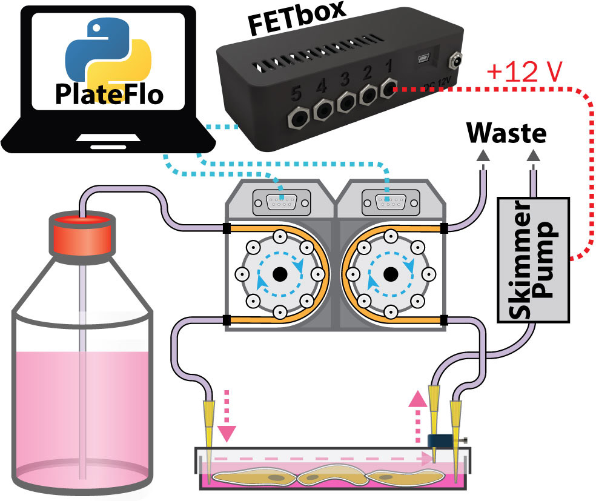

Operating Instructions
######################

System Setup
^^^^^^^^^^^^

Instructions here are generalized as much as possible. Several schematic
`Example Perfusion Setups`_ illustrate the tubing connections and some
potentially intersting experimental configurations.

General Guidelines
==================

*	The inlet/outlet pumps, media reservoirs, and fluidic tubing
        upstream of culture plates should be kept in the culture incubator
        with the plates to avoid degassing in the tubing.

*	Skimmer pumps, FETbox(es), and the waste reservoir can be
        placed exterior to the incubator. 
        
        .. note::

                Minimize fluid head for the outlet and skimmer pumps as much
                as possible for maximum performance.

*	Preheat the inlet/outlet peristaltic pumps in a dry incubator/oven
        several degrees higher than the final target temperature. This will
        minimize formation of potentially damaging condensation on the
        electronic and mechanical components.

Sterilization & Priming
=======================

Sterilization is done *in-place*, without plates connected. Use
a straight barbed fitting at the point in the tubing where the plate will
eventually be connected. This joint can be easily split and connected directly
to the tubing already connected to the plate.

1.	Connect a 70% EtOH bottle to all reservoir connections.

2.	Disengage the outlet pump tubing such that the inlet pumps can pump
        freely all the way to the waste.

3.	Run the inlet pump at full speed until at least several volumes have
        passed through the fluid circuit.
        
        .. important::
                If using pinch valves in the circuit, cycle their positions
                regularly to ensure full EtOH penetration.

4.	Connect all reservoir inlets to their final culture media reservoirs.

5.	Repeat (3) to purge EtOH from the system and prime with media. 

        .. note:: 
                
                If multiple reservoirs are utilized, take care that the line 
                downstream of the valves contains the correct medium for the
                start of the experiment.

6.	Engage all peristaltic pump head clamps to prevent backflow and spillage
        when connecting the plates later.

7.	Sterilize the skimmer tubing by pumping 70% EtOH through, then run dry
        to clear. Wrap exposed tubing ends in sterilized aluminum foil until
        ready to connect to perfusion plate.

Perfusion Plate Connection
==========================

#.	Seed an unaltered Nunc OmniTray plate with the desired tissue culture
        model. Allow cells sufficient time to adhere prior to initiating flow.

#.	In the tissue culture cabinet, place the assembled and sterilized
        perfusion lid onto the seeded plate base. Verify that the inlet/outlet
        nozzles sit below the media surface and do not ride on the culture
        surface.

#.	Transfer the assembled perfusion plate to the incubator.

#.      Split the tubing at the joint described in `Sterilization & Priming`_.
        The barbed fitting should remain on the outlet side.

#.	Connect the outlet pump tubing to the plate outlet tube, and press fit
        the bare inlet tubing into inlet P200 nozzle.

#.	Connect the skimmer tubing by pressing it ently into the clamped
        skimmer P200 nozzle.

#.	The system is now ready for operation.

Inlet/Outlet Flow Rate Delta
^^^^^^^^^^^^^^^^^^^^^^^^^^^^

The "skimming" approach we've taken to plate volume regulation requires a
slightly inlet flow rate than outlet flow rate, with the excess removed in a
controlled way by the skimmer system. The inlet/outlet flow rate delta
should be kept as small as possible to minimize volume fluctuation.

To determine a safe operating flow rate delta, variability of the
inlet/outlet pump flow rates between pumps and/or channels is measured.
This can be done in parallel with calibration. The exact method for calibration
is model/manufacturer specific, but generally a flow rate in the intended
operating range is set, run for a fixed period of time, weighed, and the
theoretical vs. measured dispensed volume is used to set the calibrated flow
rate. A safe flow rate delta takes into account variability between pumps,
tubing, and channels. **A safe margin is ~1.5-2x the measured flow rate range.**

If re-calibration between pump tubing replacement is undesirable, variability in
different stoppered tubing can also be considered and accounted for in the
flow rate delta. For example, below, four different pump tubes were tested
randomly across the four channels of two different Ismatec Reglo Digital pumps.
In this case high variability is observed and an inlet/outlet flow delta of ~10%
would be considered a safe operating margin.

   Measured dispensed volume of random combination of two pumps and four sets of
   stoppered tubing. Cassettes (sping arm for clamping stoppered tubing down
   against the rollers) were kept with their original pumps. n = 3 for each
   data point.

Skimmer Pumps
^^^^^^^^^^^^^

Skimmer pumps do not need to be run continuously. Excess medium accumulates
slowly (hours to days) and can therefore be removed intermittently to reduce
power consumption and wear on the skimmer pumps/tubing.

   DC peristaltic pumps (wired in 2x banks of two) connected to a FETbox for
   use as skimmer pumps (upper left). Pinch valve also pictured (lower right).

When using DC peristaltic pumps controlled by the *FETbox*, as above, the 
:doc:`PlateFlo scheduler module </software/scheduler>` can be used to run the
pumps at regular intervals as below, for example:

.. code-block:: python

   >>> from plateflo import fetbox, scheduler
   >>> from datetime import datetime, timedelta
   >>> from time import sleep

   >>> # autoconnect to FETbox
   >>> fet = auto_connect_fetbox()[0]

   >>> # create scheduler
   >>> sched = scheduler.Scheduler()

   >>> # define skimmer start/stop functions. e.g. skimmers on channels 4 & 5
   >>> def run_skimmers():
   >>>   fet.enable_chan(4)
   >>>   fet.enable_chan(5)

   >>> def stop_skimmers():
   >>>   fet.disable_chan(4)
   >>>   fet.disable_chan(5)

   >>> # schedule recurring skimmer events, run for 1 minute every 3 hours
   >>> interval = timedelta(hours = 3)
   >>> runtime = timedelta(minutes = 1)
   >>> event_skim_start = scheduler.RecurringEvent(interval = interval,
   >>>                                             task = run_skimmers)
   >>> event_skim_stop = scheduler.RecurringEvent(interval = interval,
   >>>                                            task = stop_skimmers,
   >>>                                            delay = runtime)
   >>> sched.add_event(event_skim_start)
   >>> sched.add_event(event_skim_stop)

   >>> def main():
   >>>   sched.monitor()
   >>>   sleep(1E-6)

   >>> if __name__ == "__main__":
   >>>   try:
   >>>      while(1):
   >>>         main()
   >>>   finally:
   >>>      fet.kill()

Example Perfusion Setups
^^^^^^^^^^^^^^^^^^^^^^^^

Single Plate, Single Reservoir Culture
======================================

The most fundamental PlateFlo perfusion setup. A single plate is perfused from a
single reservoir with a *FETbox* controlled skimmer pump for plate volume
control.

   Single plate, single reservoir perfusion setup.

.. tip::
   
   Inlet/outlet **pumps can be run continuously, or intermittently** (to reduce
   culture medium usage, for example) depending on the requirements of the
   system under study.

Dual Reservoir Sequential Flow Culture
======================================

Two media reservoirs are selected by a pinch valve (for e.g. glucose
stimulation) programmatically using a *FETbox* and *PlateFlo* Python package.
In addition to the standard inlet & outlet pumps, a third shared pump channel
acts as the outlet pump for plate 1, pumping directly into plate two.

   Dual reservoir, dual sequential culture plate perfusion system.

.. note::
   
   In this configuration, the `Inlet/Outlet Flow Rate Delta`_ is maintained
   across **all three pumps**. I.e. flow rate 1 > 2 > 3, from left to right.

This setup could be of use, for example, when studying the effect of subjecting
*cell line 2* to secreted factors from *cell line 1* upon stimulation with small
molecules from *reservoir B*. Similarly, it may be used for development of
co-culture differentiation protocols.

Appendix
^^^^^^^^

Selecting Skimmer Height
========================

The following standard curve can be used to as a guide select a height block
for the desired plate volume. 1.6 mm is a good starting point at ~10 mL media
in the plate.

   Plate volume vs. skimmer nozzle height standard curve. Determined by weight.
   Mean +/- standard deviation, *n* = 3.

1.2, 1.4, 1.6, and 1.8 mm height blocks are provided in the design files as
``skimmer_height_block_<height>mm.stl``. See the
:ref:`build guide <set-skimmer-height>` for
instructions on setting the skimmer nozzle height.

FETbox Serial Commands
======================

If integration with other software, manual control, or otherwise use of the 
:doc:`/software/fetbox` Python module is not suitable, the serial command
structure is outlined here.

FETbox serial commands have the following structure:
   .. code-block::

      @<CMD><BODY>\n
      |  |    |    |
      |  |    |    Line feed (LF)
      |  |    |     
      |  |    Command body, arbitrary length/contents
      |  Command code, single ASCII character
      Command start

+----------------+------------------------------------------+------------------+
|                | Serial Command                           |  Response        |
+================+==========================================+==================+
| Get Device ID  | ``@#\n``                                 | ``fetbox<id>\n`` |
|                |                                          | E.g:             |
|                |                                          | ``fetbox0\n``    |
+----------------+------------------------------------------+------------------+
| Heartbeat      | ``@?\n``                                 | ``*\n``          |
+----------------+------------------------------------------+------------------+
| Enable Channel | ``@H<chan[1-5]>\n``                      | ``@H3\n``        |
|                +------------------------------------------+                  |
|                | E.g. Chan 2 on: ``@H2\n``                |                  |
+----------------+------------------------------------------+------------------+
| Disable Channel| ``@I<chan[1-5]>\n``                      | ``*\n``          |
|                +------------------------------------------+                  |
|                | E.g. Chan 4 off: ``@I4\n``               |                  |
+----------------+------------------------------------------+------------------+
| PWM Channel    | ``@S<chan[1-5]><pwm[0-255]>n``           | ``*\n``          |
|                +------------------------------------------+                  |
|                | E.g. Chan 3 to 80: ``@S3080\n``          |                  |
+----------------+------------------------------------------+------------------+
| Hit-and-Hold   | ``@V<chan[1-5]><pwm[0-255]>\n``          | ``*\n``          |
|                +------------------------------------------+                  |
|                | E.g. Chan 5 hold 55: ``V5055\n``         |                  |
+----------------+------------------------------------------+------------------+
| Digital Read   | ``@D<pin[0-21]>\n``                      | ``<[0|1]>\n``    |
+----------------+------------------------------------------+------------------+
| Analog Read    | ``@A<pin[14-21]>\n``                     | ``<[0-1023]>\n`` |
|                +------------------------------------------+------------------+
|                | E.g. read pin 'A0'(aka 14): ``@A14\n``   | E.g. ``323\n``   |
+----------------+------------------------------------------+------------------+
| Digital Write  | ``@E<pin[0-20]><val[0|1]\n``             | ``*\n``          |
|                +------------------------------------------+                  |
|                | E.g. Pin D4 HIGH: ``E041\n``             |                  |
+----------------+------------------------------------------+------------------+
| Analog Write   | ``@B<pin[3,5,6,9,10,11]><pwm[0-255]>\n`` | ``*\n``          |
|                +------------------------------------------+                  |
|                | E.g. Pin D5 to 155: ``@B05155\n``        |                  |
+----------------+------------------------------------------+------------------+
