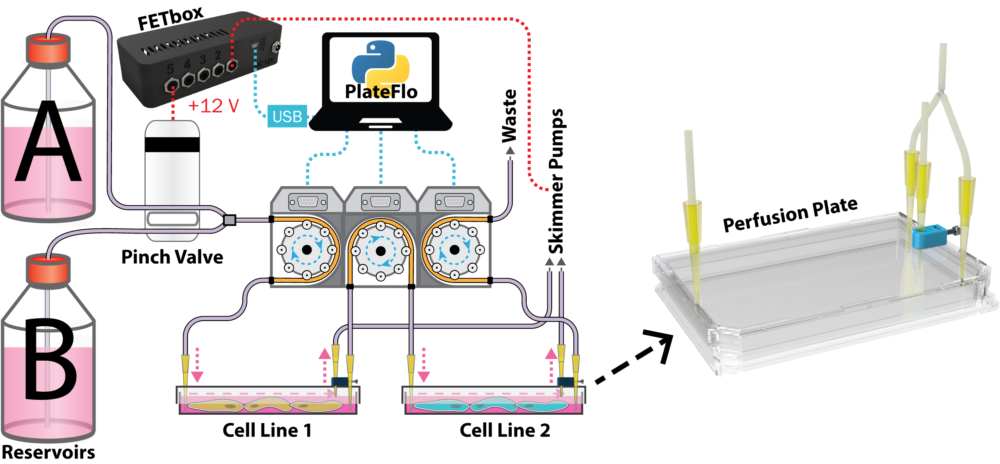

PlateFlo - Plate Scale Perfusion System
=======================================
A modular system for programmable, plate-scale perfusion of adherent cell lines.

---------------------------------------

This documentation is written to accompany **<publication link
placeholder>**. See peer-reviewed article for detailed description and
characterization of the hardware.

   
   **Left** Schematic overview of a multi-plate multi-reservoir perfusion setup
   controlled programmatically using the PlateFlo python package.
   **Right** PlateFlo perfusion plate. A modified Nunc® OmniTray® culture
   plate.

.. toctree::
   :maxdepth: 2
   :caption: Hardware

   hardware/bom
   hardware/design_files
   hardware/build_guide
   hardware/operation

.. toctree::
   :maxdepth: 2
   :caption: PlateFlo Python Package

   software/fetbox
   software/scheduler
   software/API/api_index

.. toctree::
   :maxdepth: 2
   :caption: Legal
   
   legal/license
   legal/disclaimer

Indices and Tables
==================

* :ref:`genindex`
* :ref:`modindex`
* :ref:`search`

